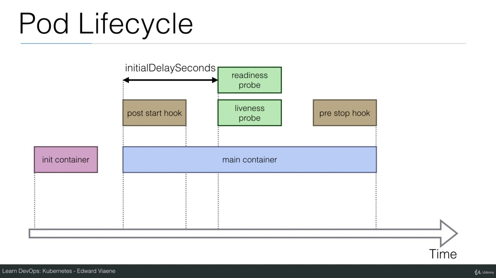

# Kubernetes-Learning

## Author

[](https://www.linkedin.com/in/tkhamphousone)

---

<br/>

## For Docker

```bash
$ docker build -t yulypso/node-app:v0.0.1 .
$ Docker run -p 8000:3000 yulypso/node-app
```

---

<br/>

## For Kubernetes

### Docker - create image + push DockerHub: Dockerfile
1. Create server app listening at port XXXX
2. Add Dockerfile config for Docker
3. Build Docker container and specify tag
    ```bash
    $ docker build -t yulypso/node-app:v0.0.1 .
    ```
4. Push Docker image on DockerHub
    ```bash 
    $ docker push yulypso/node-app #get latest by default 
    ```

### Kubernetes - create pod/service: Pods/ Services/
1. Create pod yml file
2. Create pod on the Kubernetes cluster
    ```bash
    $ kubectl create -f Pods/pod-1.yml
    ```
3. Create service 
   1. LoadBalancer
       - Expose pod through command line
       ```bash
       $ kubectl expose pod www.my-node-app.com --port=3000 --name=node-app-service --type=LoadBalancer
       ```
       - Create service yml file
       ```bash
       $ kubectl create -f Services/service-1.yml # type: LoadBalancer
       ```
    2. NodePort
       - Expose pod through command line
       ```bash
       $ kubectl expose pod www.my-node-app.com --port=3000 --name=node-app-service --type=NodePort
       ```
       - Create service yml file
       ```bash
       $ kubectl create -f Services/service-1.yml # type: NodePort
       ```
4. Access exposed service 
   1. LoadBalancer
        > **localhost:\<port\>** from the browser //current port: 3000
   2. NodePort
        ```bash
        $ kubectl port-forward service/node-app-service 5000:3000
        ```
        > **localhost:\<port\>** from the browser //current port: 5000

**Info:** Kubernetes needs DockerHub images to work
**Info:** Kubernetes exposed pod port must be at the same image defined port.

<br/>

### Useful command

- Attach to the running process (get some logs if exists)
```
$ kubectl attach www.my-node-app.com
```

- Execute commands within a container
```bash
$ kubectl exec www.my-node-app.com -- ls
```

- Execute a shell, this creates a new pod with a new container
```bash
$ kubectl run -i --tty node-app-sh --image=yulypso/node-app --restart=Never -- sh
```

---

<br/>

### Kubernetes - Create ReplicationController: Controllers/

Horizontal scaling **Only for Stateless app** 

```bash
# Create
$ kubectl create -f Controllers/controller-1.yml 

# Rescale to 4 pods
$ kubectl scale --replicas=4 -f Controllers/controller-1.yml
$ kubectl scale --replicas=4 rc/node-app-controller
```

---

<br/>

### Kubernetes - Create Deployments: Deployments/

```bash
# Create deployment
$ kubectl create -f Deployments/deployment-1.yml  

# Expose deployment
$ kubectl expose deployment node-app-deployment --type=LoadBalancer --port=3000 --name=node-app-deployment
```

Browser acces: http://localhost:3000
-> "Node Server"

```bash
# Run deployment with another version of image (version: v0.0.2)
$ kubectl set image deployment/node-app-deployment node-app=yulypso/node-app:v0.0.2

# Get deployment status after updating version
$ kubectl rollout status deployment/node-app-deployment
```

Browser acces: http://localhost:3000
-> "Node Server Version 2"

```bash
# Get rollout history
$ kubectl rollout history deployment/node-app-deployment

# Run deployment to the previous version 
$ kubectl rollout undo deployment/node-app-deployment

# Run deployment to a previous version n (number comes from rollout history)
$ kubectl rollout undo deployment/node-app-deployment --to-revision=n
```

Browser acces: http://localhost:3000/
-> "Node Server"

**Info:** Kubernetes version changes must be on DockerHub to work

---

<br/>

### Add Label to a Node

```bash
$ kubectl label nodes docker-desktop hardware=high-spec
```

---

<br/>

### Lifecycle

<p align="center" width="100%">
    
</p>

1. init container starts, usually to start database (status: pod scheduled)
2. post start hook is run for settings (status: pod initialized)
3. main container starts
4. health check: readiness probe (status: pod ready)
5. main container duration was set on 120 sec then it sleeps
6. pre stop hook starts
7. health check: liveness probe -> restart pod and go back to 1.

Screen 1
```bash
$ watch -n1 kubectl get pod

# 1
NAME                         READY   STATUS    RESTARTS   AGE
lifecycle-596bcc4b98-nll8s   0/1     Running   0          12s

#2
NAME                         READY   STATUS    RESTARTS   AGE
lifecycle-596bcc4b98-nll8s   1/1     Running   0          40s

#3
NAME                         READY   STATUS      RESTARTS   AGE
lifecycle-596bcc4b98-nll8s   0/1     Completed   1          2m

#4
NAME                         READY   STATUS    RESTARTS   AGE
lifecycle-596bcc4b98-nll8s   0/1     Running   1          2m20s
```

Screen 2
```bash
$ kubectl create -f Deployments/deployment-4.yml    
$ kubectl exec -it lifecycle-596bcc4b98-nll8s -- tail -f /timing
# -i: stdin
# -t: tty
# -- [command]: executes tail -f on the file timing at / 
1618331430: Running
1618331430: postStart
1618331440: end postStart
1618331469: livenessProbe
1618331470: readinessProbe
1618331479: livenessProbe
1618331480: readinessProbe
command terminated with exit code 137

#2 we need to wait the pod restarts : 
error: unable to upgrade connection: container not found ("lifecycle-container")
```

---

<br/>

### {get, edit} information

```bash
$ kubectl {get, edit} {pod|po} [--show-labels] [--output=wide]
$ kubectl {get, edit} {deployment|deploy} 
$ kubectl {get, edit} {service|svc}
$ kubectl {get, edit} {replicationcontroller|rc}
$ kubectl {get, edit} {replicaset|rs}
$ kubectl {get, edit} {node|no} [--output=wide] [--show-labels]
$ kubectl {get, edit} {serviceaccount|sa}
$ kubectl {get, edit} {secrets}
$ kubectl {get, edit} {namespace}

# watch in real time pod status
$ watch -n1 kubectl get pod

# using specific namespace/context=kube-system
$ kubectl -n kube-system get secret
```

---

<br/>

### Kubernetes Dashboard


```bash
$ kubectl apply -f https://raw.githubusercontent.com/kubernetes/dashboard/master/aio/deploy/recommended.yaml

$ kubectl proxy &
```
Browser acces: http://localhost:8001/api/v1/namespaces/kubernetes-dashboard/services/https:kubernetes-dashboard:/proxy/\#/service?namespace=default

---

<br/>

### Secrets

```bash
# generate secret using files
$ kubectl create secret generic db-user --from-file=Secrets/username.txt --from-file=Secrets/password.txt

# generate secret for SSH key or SSL certificate
$ kubectl create secret generic ssl-certificate --from-file=~/.ssh/id_rsa --ssl-cert=ssl-cert=myssl/cert.crt

# create a deployment
$ kubectl create -f Deployments/deployment-5.yml

# access bash
$ kubectl exec -it node-app-deployment-<random pod value> -- /bin/bash

# get credentials, useful to connect database
root@node-app-deployment-6dd5cfffd7-46tmh:/usr/src/app# cat /etc/creds/username 
yulypso
root@node-app-deployment-6dd5cfffd7-46tmh:/usr/src/app# cat /etc/creds/password 
root
```


---

<br/>

### Yml files

- **service-2.yml**: create a service type NodePort for a **pod-1.yml** created, browser acces at http://localhost:31001
- **deployment-2.yml**: create a deployment for a specific Node by specifying a label. Useful for cluster with multiple Nodes. 
- **deployment-3.yml**: create a deployment with health check to ensure the availability and resiliency of the app even if the pod and deployment are still alive.
- **deployment-4.yml**: create a deployment for lifecycle (postStar/preStop)
- **deployment-5.yml**: create a deployment using Secrets
- **deployment-6.yml**: create a deployment for security context for a pod/container

---

<br/>

### Namespaces 

```bash
# know current context (by default: docker-desktop namespace)
$ kubectl config current-context

$ kubectl config get-contexts

$ kubectl get namespace

# change namespace by configuring the context
$ kubectl config set-context $(kubectl config current-context) --namespace=<namespace name>

# we can create a deployment in a specific namespace
$ kubectl create deployment --image nginx demo-nginx --namespace=<namespace name>
```

---

<br/>

### Wordpress on Kubernetes

```bash
$ kubectl create -f Apps/Wordpress/wordpress-secrets.yml
secret/wordpress-secrets created
$ kubectl create -f Apps/Wordpress/wordpress-single-deployment-no-volumes.yml
deployment.apps/wordpress-deployment created
$ kubectl create -f Apps/Wordpress/wordpress-service.yml
service/wordpress-service created
```

---

<br/>

### ConfigMap

Configuration parameters that are not secret can be put in a ConfigMap. 
It can:
- contains environment variables
- contains container commandline arguments
- use volumes
- contains full configuration files for a webserver by mounting it using volumes to "inject" configuration settings into containers without changing the container itself

```bash
# create configmap from file
$ kubectl create configmap nginx-config --from-file=ConfigMaps/Configurations/reverseproxy.conf

$ kubectl get configmap
NAME           DATA   AGE
nginx-config   1      54s

$ kubectl get configmap nginx-config -o yaml

$ kubectl create -f Configmaps/nginx.yml
$ kubectl create -f Configmaps/nginx-service.yml

$ curl http://localhost:<nodePortIP> -v 

# -c to specify which container to access within the pod
$ kubectl exec -it helloworld-nginx -c nginx -- bash 
```
